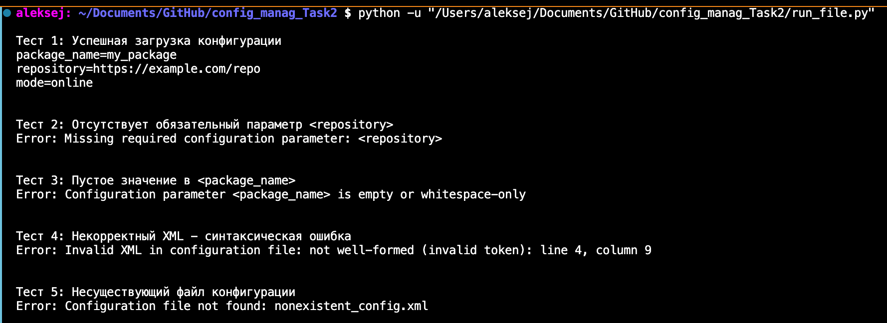

# Визуализатор графа зависимостей пакетов — Этап 1

## Общее описание

Проект представляет собой **минимальный прототип CLI-приложения** для визуализации графа зависимостей пакетов. На первом этапе реализована **заготовка с поддержкой конфигурации через XML**, без фактического анализа зависимостей. Цель — продемонстрировать корректную обработку пользовательских настроек и ошибок при запуске.

---

## Функции и настройки

### Основные возможности:
- **Чтение конфигурации из XML-файла**
- **Вывод параметров в формате `ключ=значение`**
- **Обработка ошибок для всех параметров**:
  - Отсутствует файл конфигурации
  - Некорректный XML
  - Отсутствуют обязательные параметры
  - Пустые значения

### Параметры командной строки:
- **`--config [путь]`** — путь к XML-файлу с конфигурацией (обязательный)

### Настраиваемые параметры (в XML):
- **`<package_name>`** — имя анализируемого пакета
- **`<repository>`** — URL репозитория или путь к локальному файлу тестового репозитория
- **`<mode>`** — режим работы с репозиторием (например, `online`, `offline`, `test`)

---

## Формат конфигурационного файла

Конфигурационный файл должен быть в формате **XML** и содержать корневой элемент `<config>` с тремя дочерними тегами:

```xml
<config>
    <package_name>my_package</package_name>
    <repository>https://example.com/repo</repository>
    <mode>test</mode>
</config>
```

Все три тега обязательны и не могут быть пустыми.

---

## Сборка и запуск

### Базовый запуск:
```bash
python task2.py --config config_corr.xml
```

### Пример успешного вывода:
```
package_name=my_package
repository=https://example.com/repo
mode=online
```

---

## Тестирование

Для демонстрации корректной обработки ошибок и успешных сценариев подготовлены **тестовые XML-файлы** и скрипт запуска.

### Тестовые конфигурации:

| Файл | Описание |
|------|--------|
| `config_corr.xml` | Корректная конфигурация |
| `config_missing_rep.xml` | Отсутствует параметр `<repository>` |
| `config_missing_packnm.xml` | Значение `<package_name>` пустое |
| `config_invalid_xml.xml` | Синтаксически некорректный XML - незакрытая скобка |
| `nonexistent_config.xml` | Файл не существует |

### Запуск всех тестов:
```bash
python run_file.py
```

Скрипт `run_file.py` последовательно запускает `main.py` с разными конфигурациями и выводит результаты.

### Пример содержимого `run_file.py`:
```python
import subprocess
import os

test_cases = [
    ("Тест 1: Успешная загрузка конфигурации", "config_corr.xml"),
    ("Тест 2: Отсутствует обязательный параметр <repository>", "config_missing_rep.xml"),
    ("Тест 3: Пустое значение в <package_name>", "config_missing_packnm.xml"),
    ("Тест 4: Некорректный XML - синтаксическая ошибка", "config_invalid_xml.xml"),
    ("Тест 5: Несуществующий файл конфигурации", "nonexistent_config.xml"),
]

for desc, config_file in test_cases:
    print(f"\n{desc}")
    result = subprocess.run(["python", "task2.py", "--config", config_file])
    print()
```

---

## Примеры использования

```bash
# Успешный запуск
python task2.py --config config_corr.xml

# Ошибки конфигурации
python task2.py --config config_missing_rep.xml
python task2.py --config config_missing_packnm.xml
python task2.py --config nonexistent.xml
python task2.py --config config_invalid_xml.xml
```

---

## Тесты


