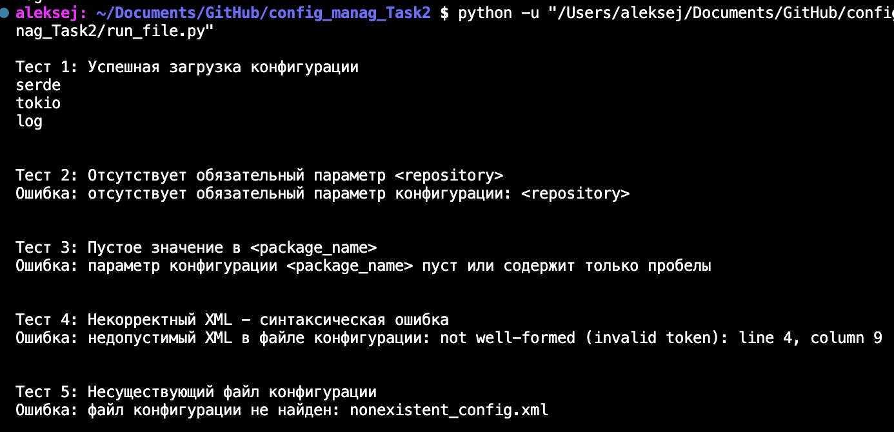

# Визуализатор графа зависимостей пакетов — Этап 2

## Ссылка на репозиторий
https://github.com/AlexeyAndreevDM/config_manag_Task2.git

## Общее описание

Проект представляет собой CLI-приложение для сбора данных о прямых зависимостях Rust-пакета. На втором этапе реализована логика извлечения зависимостей из локального `Cargo.toml`, без использования менеджеров пакетов или сторонних библиотек. Цель — продемонстрировать корректное чтение конфигурации и извлечение зависимостей вручную.

---

## Функции и настройки

### Основные возможности:
- Чтение конфигурации из XML-файла
- Поддержка только режима `local`
- Поиск файла `Cargo.toml` в локальном репозитории
- Извлечение имён прямых зависимостей из секции `[dependencies]`
- Вывод зависимостей — по одной на строку
- Обработка ошибок:
  - Отсутствует файл конфигурации
  - Некорректный XML
  - Отсутствуют или пусты обязательные параметры
  - Указан неподдерживаемый режим (`mode != "local"`)
  - Файл `Cargo.toml` не найден

### Параметры командной строки:
- `--config [путь]` — путь к XML-файлу с конфигурацией (обязательный)

### Настраиваемые параметры (в XML):
- `<package_name>` — имя анализируемого пакета
- `<repository>` — локальный путь к директории с тестовым репозиторием
- `<mode>` — режим работы (только `local`)

---

## Формат конфигурационного файла

Конфигурационный файл должен быть в формате XML и содержать корневой элемент `<config>`:

```xml
<config>
    <package_name>my_package</package_name>
    <repository>./test_repo</repository>
    <mode>local</mode>
</config>
```

Все три тега обязательны и не могут быть пустыми.

## Формат Cargo.toml файла

 Cargo.toml файл должен содержать корневой раздел `dependiences`:
```
[package]
name = "my_package"
version = "0.1.0"

[dependencies]
serde = "1.0"
tokio = { version = "1.0", features = ["rt"] }
log = "0.4"
```


---

## Сборка и запуск

### Базовый запуск:
```bash
python task2.py --config config_corr.xml
```

### Пример успешного вывода:
```
serde
tokio
log
```

---

## Тестирование

Для демонстрации корректной обработки ошибок и успешных сценариев подготовлены **тестовые XML-файлы** и скрипт запуска.

### Тестовые конфигурации:

| Файл | Описание |
|------|--------|
| `config_corr.xml` | Корректная конфигурация |
| `config_missing_rep.xml` | Отсутствует параметр `<repository>` |
| `config_missing_packnm.xml` | Значение `<package_name>` пустое |
| `config_invalid_xml.xml` | Синтаксически некорректный XML - незакрытая скобка |
| `nonexistent_config.xml` | Файл не существует |

### Запуск всех тестов:
```bash
python run_file.py
```

Скрипт `run_file.py` последовательно запускает `main.py` с разными конфигурациями и выводит результаты.

### Пример содержимого `run_file.py`:
```python
import subprocess
import os

test_cases = [
    ("Тест 1: Успешная загрузка конфигурации", "config_corr.xml"),
    ("Тест 2: Отсутствует обязательный параметр <repository>", "config_missing_rep.xml"),
    ("Тест 3: Пустое значение в <package_name>", "config_missing_packnm.xml"),
    ("Тест 4: Некорректный XML - синтаксическая ошибка", "config_invalid_xml.xml"),
    ("Тест 5: Несуществующий файл конфигурации", "nonexistent_config.xml"),
]

for desc, config_file in test_cases:
    print(f"\n{desc}")
    result = subprocess.run(["python", "task2.py", "--config", config_file])
    print()
```

---

## Примеры использования

```bash
# Успешный запуск
python task2.py --config config_corr.xml

# Ошибки конфигурации
python task2.py --config config_missing_rep.xml
python task2.py --config config_missing_packnm.xml
python task2.py --config nonexistent.xml
python task2.py --config config_invalid_xml.xml
```

---

## Тесты


